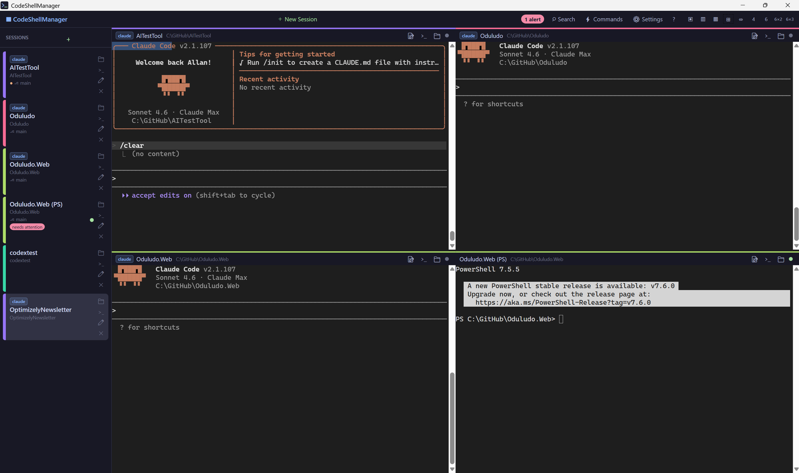

# CodeShellManager

[](https://github.com/umage-ai/CodeShellManager/actions/workflows/build.yml)
[](https://github.com/umage-ai/CodeShellManager/releases/latest)
[](https://winstall.app/apps/UmageAI.CodeShellManager)
[](https://community.chocolatey.org/packages/codeshellmanager)
[](LICENSE)

> **🌐 [umage.ai/products/code-shell-manager](https://umage.ai/products/code-shell-manager/)** — product page, screenshots, and latest news

A Windows desktop app for running **multiple AI coding agents side-by-side** — Claude Code, Codex, GitHub Copilot, or any CLI tool — in a tabbed and grid-layout terminal host.

Built with WPF + [xterm.js](https://xtermjs.org/) + Windows ConPTY for full pseudo-terminal fidelity.



---

## Why CodeShellManager

Most multi-agent tools are task orchestrators: a chat UI around one vendor's agent, a handful of parallel tasks, a diff to review. CodeShellManager is built for a different job. It hosts **many long-lived agent sessions as real terminals**, and helps you keep track of all of them.

- **The real CLI, nothing lost.** Each session is the actual `claude` (or `codex`, `copilot`, `gemini`, `pwsh`…) running in a real pseudo-terminal, through your own PowerShell profile. Hooks, plugins, slash commands, status lines and profile functions all work exactly as in Windows Terminal. Chat-style wrappers lose some of these, especially in WSL.
- **Search everything every session ever printed.** All output is indexed to SQLite FTS5. Find the session that printed that error, URL or decision, even after it was closed, and relaunch it from the result.
- **Built for fleets, not a handful.** Up to 18 panes on screen, groups with bulk actions, sleep/wake to park projects without killing them, restart-all to pick up a new CLI build, and staggered Claude launches that avoid config corruption. Tested at 50+ sessions.
- **Know who needs you.** Sessions waiting for input or tool approval get a green/orange dot and a tray notification.
- **Run commands beside the agent.** F5 runs tests or a build in a separate background process with output in a drawer, then pastes the result to the agent in one click. The agent's terminal is never touched.
- **A native Windows app.** WPF + ConPTY. No Electron, Python, daemon, tmux or WSL required. Local, SSH and WSL sessions side by side. Install with winget or Chocolatey; no account; MIT.

## How it compares

A condensed view, as of October 2026. Tools without a Windows build (Conductor, Superset, cmux) are left out. See [docs/comparison.md](docs/comparison.md) for the full matrix, more tools and sources.

✅ has it · ◐ partial · ❌ doesn't · ? unconfirmed

| | **CodeShellManager** | Claude Code Desktop | Nimbalyst | Orca | Herdr | Claude Squad |
|---|---|---|---|---|---|---|
| Windows | ✅ native | ✅ native | ✅ native | ✅ native | ◐ beta | ◐ WSL only |
| Real terminal per session | ✅ | ❌ chat UI | ❌ chat UI | ◐ | ✅ | ✅ |
| Any CLI agent or shell | ✅ | ❌ Claude only | ◐ 2–4 agents | ◐ 4 agents | ✅ | ◐ |
| Full-text search across all session output | ✅ | ❌ | ◐ task search | ❌ | ❌ | ❌ |
| Sessions visible at once | ✅ 18 | ◐ 2 | ? | ? | ✅ panes | ◐ |
| Sleep a session, keep its slot | ✅ | ◐ archive | ❌ | ❌ | ❌ | ◐ pause |
| Waiting / approval detection | ✅ | ◐ on finish | ✅ | ? | ✅ | ◐ |
| SSH + WSL sessions | ✅ | ✅ | ◐ | ◐ SSH | ◐ SSH | ❌ |
| Per-session run commands | ✅ | ◐ preview servers | ❌ | ❌ | ❌ | ❌ |
| Git worktrees | ◐ manual | ✅ | ✅ | ✅ | ❌ | ✅ |
| Diff / review view | ❌ [#148](https://github.com/umage-ai/CodeShellManager/issues/148) | ✅ | ✅ | ✅ | ❌ | ✅ |
| Agents keep running with the window closed | ❌ [#149](https://github.com/umage-ai/CodeShellManager/issues/149) | ✅ cloud | ? | ? | ✅ | ✅ |
| Licence | MIT | Proprietary | MIT | MIT | AGPL-3.0 | AGPL-3.0 |

Spotted something out of date? Competitors move fast. [Open an issue](https://github.com/umage-ai/CodeShellManager/issues) and we'll correct it.

## Features

- **Multi-terminal grid** — run up to 18 sessions simultaneously in configurable layouts (1, 2, 3, 4, 6 columns; 2×2, 6×2, 6×3 grids); the active pane is highlighted with a 2px accent ring so it's easy to spot
- **Sidebar groups** — organise sessions into named groups with their own color and filter strip; bulk actions (sleep / close / re-group) operate on the active group
- **Sleep & wake** — 💤 button parks a session: PTY torn down, but the session (and its notes) stays in the sidebar so you can wake it later from where you left off. Great when you have many long-running projects but only need a few live at once.
- **Restart sessions** — ↻ restarts a session in place (Claude conversations resume), or restart a whole group or every session to pick up a new CLI build; bulk restarts show progress and can be stopped
- **Git worktrees** — start a new session in a fresh worktree from any session's branch; sibling worktrees can be grouped together in the sidebar
- **Edit session** — change a session's folder, command, SSH/WSL target or appearance after it was created
- **Recently closed** — Ctrl+Shift+T reopens the last-closed session (browser convention); the New Session dialog also lists the last 10 closed sessions for one-click revival
- **Per-session run commands** — define a list of labelled commands per session (Test, Build, Watch…); ▶ runs the default, F5 / Shift+F5 run/stop it, output streams into a side drawer without touching the parent terminal. Optional post-run URL opens in your browser on exit code 0.
- **Full-text search** — all terminal output indexed to SQLite FTS5; instant search across every session, ever
- **Per-project notepad** — collapsible 📝 notes panel on every terminal, auto-saved and searchable
- **Alert detection** — detects when Claude is waiting for input or tool approval; green/orange dot indicators
- **Git status** — shows branch and dirty state in the sidebar per session
- **Session rename** — double-click any session name or click ✏ to rename inline
- **Shell integration** — programs running in a session can push their accent color, git branch / dirty state, and tab title to CSM via OSC 9001 (handy for SSH overlays). See [`docs/shell-integration.md`](docs/shell-integration.md).
- **Auto-resume** — automatically resumes the last Claude Code session when restoring on startup (`--resume <id>`); toggleable in Settings
- **SSH remote sessions** — connect to remote hosts using your existing SSH config; sessions persist across restarts
- **Windows Terminal profile import** — opt-in import of profiles from Windows Terminal's `settings.json`; pick a profile in the New Session dialog to stamp its font, color scheme, cursor and padding onto the new terminal
- **Launch & shutdown spinners** — every starting session shows a brief overlay (`Starting <cmd>…` or `Connecting to <host>…`) until the first PTY byte arrives; closing the window shows a "Shutting down…" overlay during session disposal
- **WSL sessions** — first-class session type for any installed WSL distro: distro picker (auto-detected via `wsl -l -v`), Linux working folder, optional `-u` user override; git status works via the `\\wsl$\<distro>` UNC view
- **Session history** — clicking a search result from a closed session offers to relaunch it
- **Configurable launch commands** — customise the commands available in the New Session dialog
- **Claude badge** — sessions running `claude` commands get a visual indicator
- **Tray icon** — balloon notifications for alerts; double-click to bring the window forward
- **Settings window** — all options configurable; persisted as JSON

## Requirements

- Windows 10 version 1903+ or Windows 11
- [Microsoft Edge WebView2 Runtime](https://developer.microsoft.com/en-us/microsoft-edge/webview2/) (pre-installed on Windows 11; available as a free download for Windows 10)

> **Note:** The `.msi` installer does not bundle the WebView2 runtime. If you're on Windows 10 and see a blank terminal pane, install the WebView2 runtime from the link above.

## Installation

### winget (recommended)

```powershell
winget install UmageAI.CodeShellManager
```

Future updates pick up automatically with `winget upgrade UmageAI.CodeShellManager` (or `winget upgrade --all`).

### Chocolatey

```powershell
choco install codeshellmanager
```

Upgrade with `choco upgrade codeshellmanager` (or `choco upgrade all`).

### Download from Releases

1. Go to [**Releases**](https://github.com/umage-ai/CodeShellManager/releases/latest)
2. Download either:
   - `CodeShellManager-x.y.z-Setup.msi` — installer (adds Start Menu + Desktop shortcuts, supports uninstall via Apps & Features)
   - `CodeShellManager-x.y.z-win-x64.zip` — portable; extract and run `CodeShellManager.exe`

### Build from source

**Requirements:** [.NET 10 SDK](https://dotnet.microsoft.com/download/dotnet/10.0), Windows 10/11

```bash
git clone https://github.com/umage-ai/CodeShellManager.git
cd CodeShellManager
dotnet run --project src/CodeShellManager/CodeShellManager.csproj
```

### Command-line flags

| Flag | Effect |
|------|--------|
| `--clean` | Start with no preloaded sessions and skip writing `state.json` for the run. Useful when developing — your saved sessions/settings are left untouched. |

## Keyboard Shortcuts

| Key | Action |
|-----|--------|
| `Ctrl+T` | New session |
| `Ctrl+Shift+T` | Reopen the most-recently-closed session |
| `Ctrl+Alt+T` | Duplicate the active session |
| `Ctrl+W` | Close active session |
| `Ctrl+F` | Toggle search |
| `Ctrl+Tab` / `Ctrl+Shift+Tab` | Cycle sessions |
| `F5` | Run the active session's default run-command |
| `Shift+F5` | Stop the active session's running run-command |
| `Escape` (in search) | Close search panel |

## Layout Options

Click the layout buttons in the toolbar (right side):

| Button | Layout |
|--------|--------|
| ▣ | Single pane |
| ▥ | 2 columns |
| ▦ | 3 columns |
| ⊞ | 2×2 grid |
| ⇔ | 2 rows |
| 4 | 4 columns |
| 6 | 6 columns |
| 6×2 | 6 columns × 2 rows (12 panes) |
| 6×3 | 6 columns × 3 rows (18 panes) |

## Contributing

Issues and pull requests are welcome. See [CLAUDE.md](CLAUDE.md) for architecture notes and coding conventions.

## License

MIT — see [LICENSE](LICENSE).

---

By [umage.ai](https://umage.ai)
